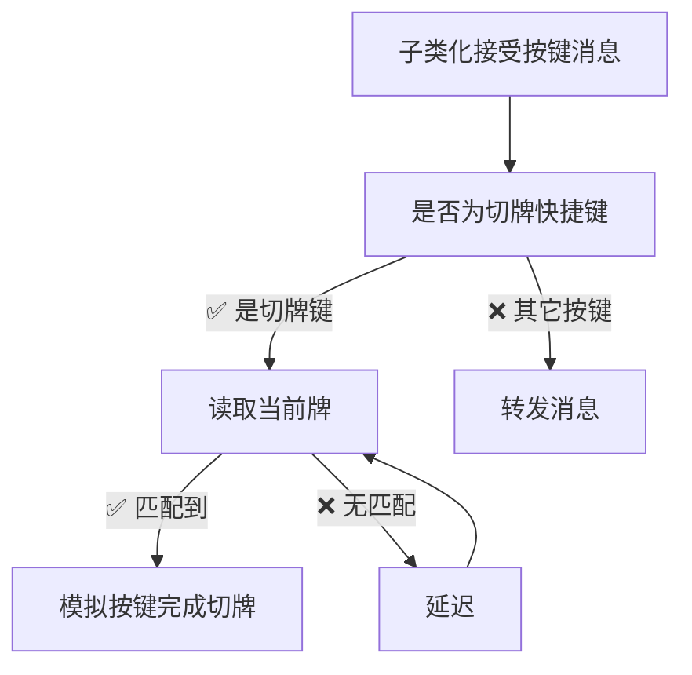

# pickFate
英雄联盟卡牌大师切牌工具  

## 如何使用
将本项目编译或者下载我编译好的版本  
用任意方式将DLL加载到游戏中，即可在游戏载入过程看到软件的主体界面（如上边的图所示）
在人物`进入对局`后，将`[√]掌控命运`勾选，即可使用设置好的快捷键进行切牌操作！  
 (不推荐将技能键和切牌键使用相同的按键)  
  
**说明**：
- 加载界面开启可能会因为读取不到数据崩溃！
- 开启软件会读取英雄当前名称是否符合，不符合则无法开启
- 如果符合但是无法开启就是基址/偏移过期，没有正确读到英雄名
- 如果载入看不到窗口可以开启控制台界面看SetWindowLongPtr是否成功
- 没有使用HOOK之类的手段，只是进行内存读取和模拟按键，个人多次使用没有封号
- 我不常在GITHUB上线，可以[点击链接加入QQ群聊【玄间】反馈BUG](http://qm.qq.com/cgi-bin/qm/qr?_wv=1027&k=Okd2GD-paHivHmPCH3HejuxztqUYlscU&authKey=l0grOm6QHx89Lc09DnpWrQbhFkdW2fxKVxJMY7RvvBX%2BGnxHvidgohivYryzO3Gu&noverify=0&group_code=628543673) 群号：628543673
### 等待添加的功能
- [ ] 大招一段/二段 自动切牌
- [ ] 是否进入游戏判断
- [ ] 识别到英雄自动开启切牌
- [ ] 技能CALL(封号)
- [ ] HOOK(封号)

### 已经完成的功能
- [x] 保存按键配置 // 2025-06-17
- [x] 自定义快捷键 // 英文键/数字键
- [x] 切指定颜色牌 // 秒切黄牌 秒切金牌 秒切蓝牌 秒切红牌 : )
- [x] 防截屏/录制 // Windows 10版本 > 2004
- [x] 判断技能是否在冷却'P'
- [x] CTRL按下时不切牌

### 没什么技术含量的实现
- 如果愿意提供更好地方案请联系我！

---
