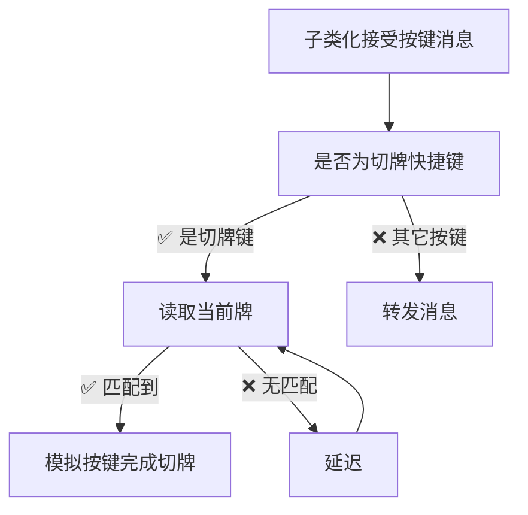

# pickFate
英雄联盟卡牌大师切牌工具(测试版)  

## 如何使用
将本项目编译或者[下载我编译好的版本](https://github.com/dearkiku/pickFate/releases/tag/TEST)，用任意方式将DLL加载到游戏中，即可在游戏载入过程看到软件的主体界面（如上边的图所示），在人物<ins>进入对局</ins>后，将[√]掌控命运勾选，即可使用设置好的快捷键进行切牌操作！(不推荐将技能键和切牌键使用相同的按键)  
  
**说明**：
- 加载界面开启可能会因为读取不到数据崩溃！
- 开启软件会读取英雄当前名称是否符合，不符合则无法开启
- 如果符合但是无法开启就是基址/偏移过期，没有正确读到英雄名
- 如果载入看不到窗口可以开启控制台界面看SetWindowLongPtr是否成功
- 没有使用HOOK之类的手段，只是进行内存读取和模拟按键，个人多次使用没有封号
### 等待添加的功能
- [ ] 大招一段/二段切牌
- [ ] 保存按键配置
- [ ] 是否进入游戏判断
- [ ] 识别到英雄自动开启切牌
- [ ] 技能CALL(封号)
- [ ] HOOK(封号)

### 已经完成的功能
- [x] 自定义快捷键
- [x] 切指定颜色牌
- [x] 防截屏/录制
- [x] 判断技能是否在冷却'P'

### 没什么技术含量的实现
- 如果愿意提供更好地方案请联系我！

---
